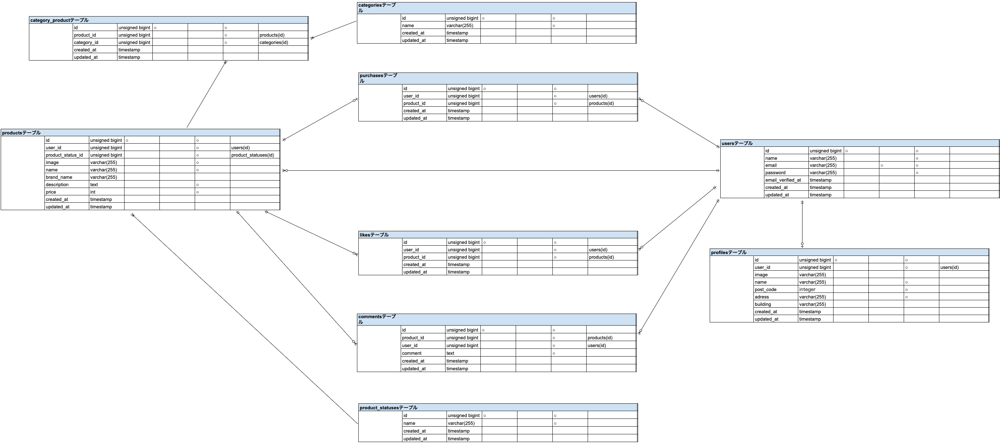

# flea-market
## アプリ概要

フリマアプリを模したWebアプリケーションです。

### 主な機能
- 会員登録
- ログイン認証
- メール認証
- 商品出品
- 商品検索
- いいね機能
- コメント機能
- 商品購入機能
- Stripe決済
- プロフィール変更

## 環境構築
**Dockerビルド**
1. `git clone git@github.com:Maki0421makimaki/flea-market.git`
2. リモートリポジトリの作成及び、URLの取得
3. リモートリポジトリのURLを変更
`git remote set-url origin 作成したリポジトリのurl`
4. ローカルリポジトリの内容をリモートに反映させる
`git add .`
`git commit -m "リモートリポジトリの変更"`
`git push origin main`
5. DockerDesktopアプリを立ち上げる
6. `docker-compose up -d --build`

**Laravel環境構築**
1. `docker-compose exec php bash`
2. `composer install`
3. `cp .env.example .env`、「.env.example」をコピーして「.env」を作成します。
4. .envに以下の環境変数を追加
```text
DB_CONNECTION=mysql
DB_HOST=mysql
DB_PORT=3306
DB_DATABASE=laravel_db
DB_USERNAME=laravel_user
DB_PASSWORD=laravel_pass

MAIL_MAILER=smtp
MAIL_HOST=sandbox.smtp.mailtrap.io
MAIL_PORT=2525
MAIL_USERNAME=各自のMailtrapのUSERNAME
MAIL_PASSWORD=各自のMailtrapのPASSWORD
MAIL_ENCRYPTION=tls
MAIL_FROM_ADDRESS=noreply@example.com
MAIL_FROM_NAME="${APP_NAME}"

STRIPE_PUBLIC_KEY=各自のStripe公開可能キー
STRIPE_SECRET_KEY=各自のStripeシークレットキー
```
※本アプリではMailtrapとStripeを利用しています。
各自アカウントを作成し、認証情報を取得して設定してください。


5. アプリケーションキーの作成
``` bash
php artisan key:generate
```

6. マイグレーションの実行
``` bash
php artisan migrate
```

7. シーディングの実行
``` bash
php artisan db:seed
```
8. ストレージリンクの作成
```bash
php artisan storage:link
```

9. 設定キャッシュのクリア
```bash
php artisan config:clear
```
StripeおよびMailtrapの環境変数を反映するため、設定キャッシュをクリアします。
## テスト

### テスト実行

```bash
php artisan test
```

### 実装済みテスト
- 会員登録バリデーション
- ログインバリデーション
- ログアウト機能
- 商品一覧表示
- 商品検索
- マイリスト表示
- 商品詳細情報表示
- いいね機能
- 商品購入機能
- 支払い方法選択機能
- 配送先変更機能
- プロフィール表示
- 出品機能
- メール認証機能

## 使用技術(実行環境)
- PHP 8.1.34
- Laravel 8.83.8
- MySQL 8.0.26
- nginx 1.21.1

## ER図


## URL
- 商品一覧画面：http://localhost/
- 商品詳細画面：http://localhost/item/{item_id}
- ログイン画面：http://localhost/login
- 会員登録画面：http://localhost/register
- phpMyAdmin:：http://localhost:8080/